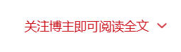
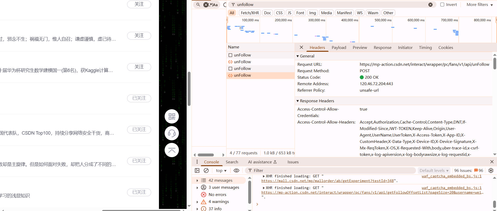
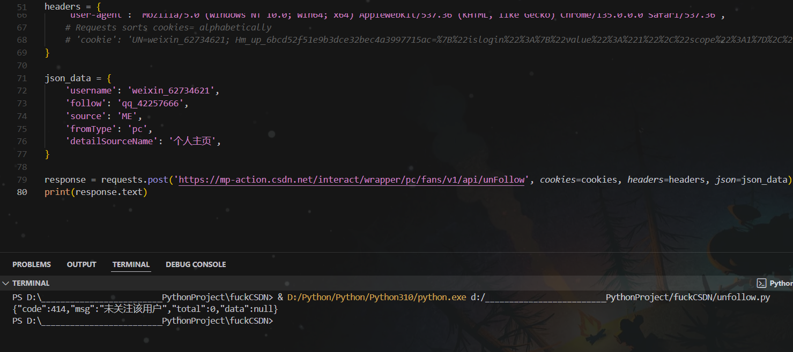
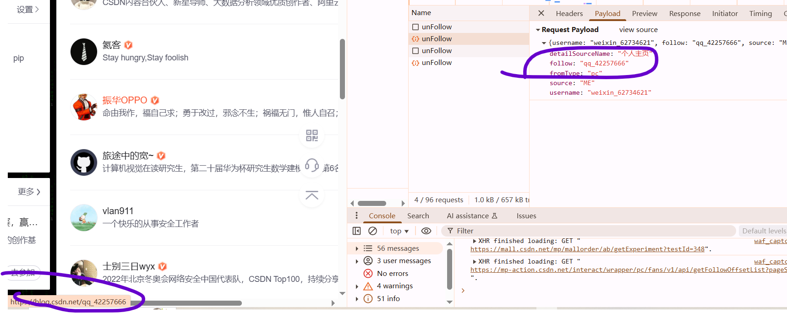
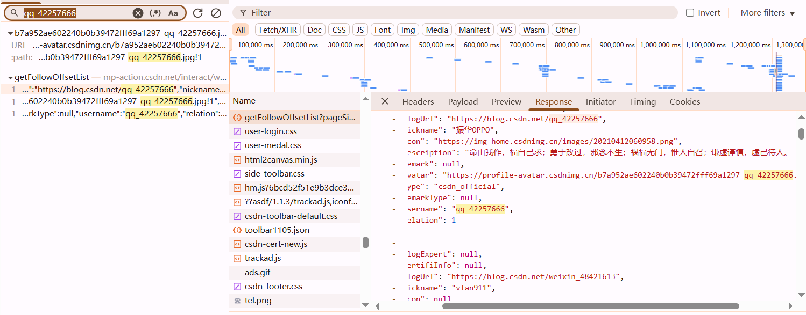
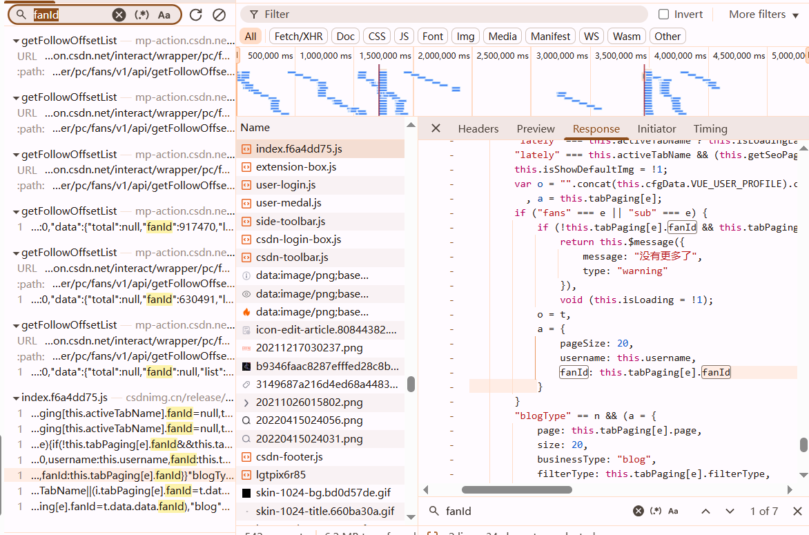
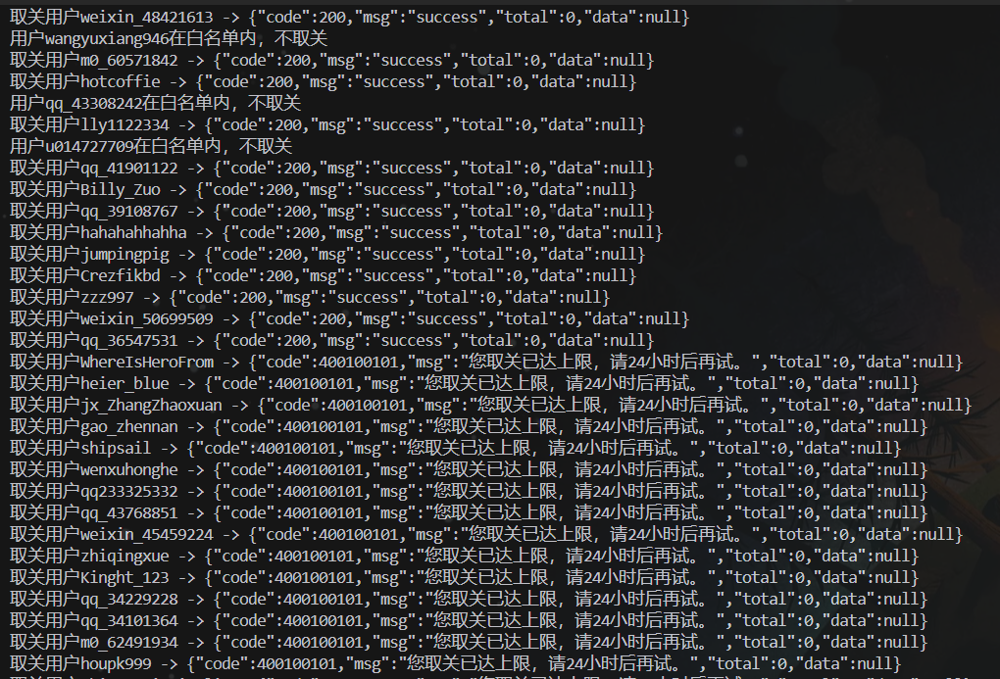

在CSDN上经常遇到关注博主才能阅读全文的流氓行为，我只是想查个东西，就要关注乱七八糟的人，让我原来关注的博主淹没在人群里。此脚本基于python协议，可设置白名单，批量取关不需要的博主。



# 分析过程

## `unFollow`取关



直接curl转python，运行看下



观察发现follow在左下角可以获取。为了避免刷新后不见，先给他关注回来，再刷新，然后搜索follow的value,看看是在哪个接口获取的





## 获取关注列表并解析

哦！所以只要获取`getFollowOffsetList`接口就行啦！

```python
headers = {
    'accept': 'application/json, text/plain, */*',
    'accept-language': 'zh-CN,zh;q=0.9,en;q=0.8,en-US;q=0.7',
    'cache-control': 'no-cache',
    'origin': 'https://blog.csdn.net',
    'pragma': 'no-cache',
    'priority': 'u=1, i',
    'referer': 'https://blog.csdn.net/weixin_62734621?type=sub&spm=1001.2101.3001.5348',
    'sec-ch-ua': '"Google Chrome";v="135", "Not-A.Brand";v="8", "Chromium";v="135"',
    'sec-ch-ua-mobile': '?0',
    'sec-ch-ua-platform': '"Windows"',
    'sec-fetch-dest': 'empty',
    'sec-fetch-mode': 'cors',
    'sec-fetch-site': 'same-site',
    'user-agent': 'Mozilla/5.0 (Windows NT 10.0; Win64; x64) AppleWebKit/537.36 (KHTML, like Gecko) Chrome/135.0.0.0 Safari/537.36',
}

params = {
    'pageSize': '20',
    'username': 'weixin_62734621',
}

response = requests.get('https://mp-action.csdn.net/interact/wrapper/pc/fans/v1/api/getFollowOffsetList', params=params, cookies=cookies, headers=headers)
print(response.text)
```

### 解析结果

```python
def parse_followings(resp_json):
    following_list = []
    data_list = resp_json['data']['list']
    for data in data_list:
        following_list.append(data['username'])

    return following_list
```

## `getFollowOffsetList`翻页功能

如果你关注的人比较多，那它不会一次性加载完，需要鼠标向下滚动，我们就要去看鼠标滚动后出现的包

### 法一: 改`pageSize`

```python
params = {
    'pageSize': '99999',
    'username': '......',
}
```

### 法二:添加`fanId`

```python
params = {
    'pageSize': '20',
    'username': 'weixin_62734621',
    'fanId': '630491'
}
```

感觉好麻烦，不看了



# 完整代码

::github{repo="teapot-4l8/fuckCSDN"}

狗屎CSDN，果然是毒瘤



# 相关推荐

一个油猴脚本，能够取消CSDN的**关注加载更多**和**登录复制**。 https://github.com/Meryl-Marcello/Disable-CSDN-Login-to-Copy-and-Sub-to-Load-more/blob/main/Unblock-CSDN.user.js